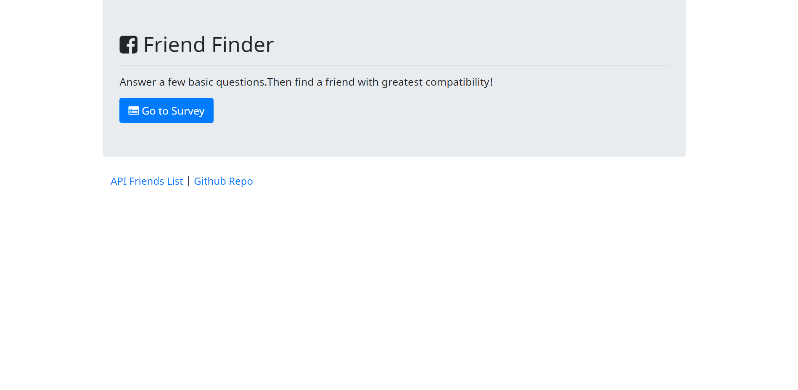

# Friend Finder Application

### Overview
This app is developed as part of Georgia Tech Coding Bootcamp homework.

It's a fun app to find a friend using [NodeJS](https://nodejs.org/en/) and [Express](https://expressjs.com/) framework. 
App asks user to fill a survey. After filling out a quick survey, our friend-matching algorithm will pair you with an individual in our network.

### How to use?
(1) Go to the homepage [https://hw-friendfinder.herokuapp.com/](https://hw-friendfinder.herokuapp.com/) and take our state-of-the-art survey. 

(2) Submite the survey

(3) Your best friend's name and photo will pop up. 

### Routes avaialble
(1) __/api/friends/__: This route provides access to data of all the friends currently available with the system. To access check this link [https://hw-friendfinder.herokuapp.com/api/friends](https://hw-friendfinder.herokuapp.com/api/friends). 

(2) __/survey__ : This route displays the Survey page. To access this route use link [https://hw-friendfinder.herokuapp.com/survey](https://hw-friendfinder.herokuapp.com/survey)

### Installation
(1) To run the app locally, clone this repository using following command,
  > `git clone git@github.com:pshegde123/FriendFinder.git`

(2) Change directory to `FriendFinder`

(3) Install the dependancies using command,
 > `npm install`

(4) To run the application locally and access it in your browser, first set the `PORT` environment variable to the value of your choice. 

> `export PORT=3030`

After the PORT environment variable has been set, run the Node.js application with the following command 

> `node server.js`

The application will now be running locally on `PORT=3030`. You can then access it locally from your browser at the URL _http://localhost:PORT_

### Technologies Used
* `JavaScript`
* `jQuery`
* `node.js`
* `Express.js`
* `HTML`
* `Bootstrap`
